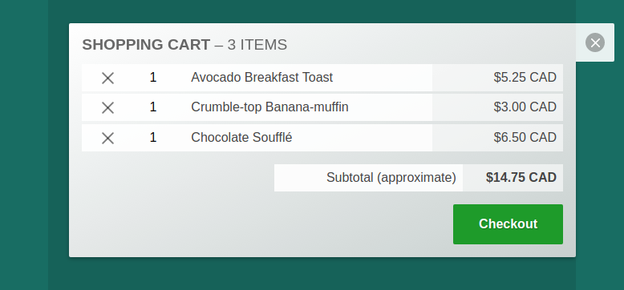

# shopper

## cart ui for custom shopify frontends

- frontend tech to implement custom shopify stores
- preact components, mobx stores, some scss
- build on [shopify js-buy-sdk](https://github.com/Shopify/js-buy-sdk)
- [**view live shopper demo**](https://chasemoskal.com/shopper/)

## current capabilities

- **display products for sale on a web page**
	- product display component
	- add to cart button

- **cart system**
	- add and remove products from cart
	- ui to change item quantities
	- big green checkout button

- **checkout through shopify**
	- cart has checkout button which initiates standard shopify checkout process

## future goals

- **persistent cart state in localstorage**
	- info like cart items and currency preference is tracked
	- if you leave the page and return, state is maintained
	- if you have multiple tabs open, all cart instances should auto-synchronize
		in realtime
	- built using sister projects [omnistorage](https://github.com/chase-moskal/omnistorage) and [crosscall](https://github.com/chase-moskal/crosscall)

- **currency conversion system**
	- currency switcher ui can be placed within cart
	- all prices on the site can flip currency based on one control
	- built using sister project [crnc](https://github.com/chase-moskal/crnc)

## notes

- **see ["global.ts"](./source/global.ts) for usage example**

- **using `mobx@4` for internet explorer compat**  
	`mobx@4` + `mobx-preact@2`

- **mobx terminology `"store"` is used a lot in the codebase**

	it's *not* an "ecommerce store" – for that meaning, we use the term "shop" instead

	a mobx `store` is where we keep observable state

- **security note: `dangerouslySetInnerHtml` is used with shopify product descriptions**

	html from the shopify api (product descriptions) is injected without
	sanitization

	this should be safe, so long as the connection to shopify is secured via
	https
